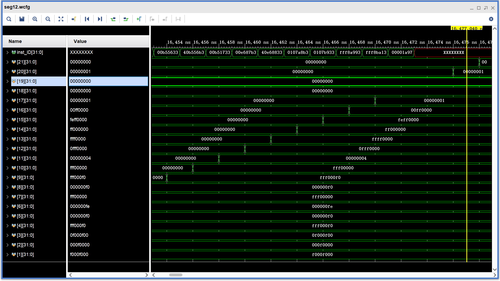
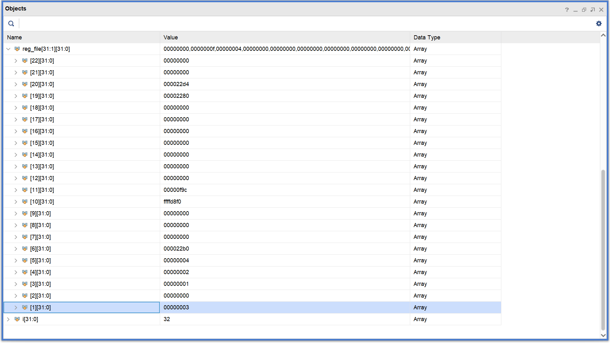
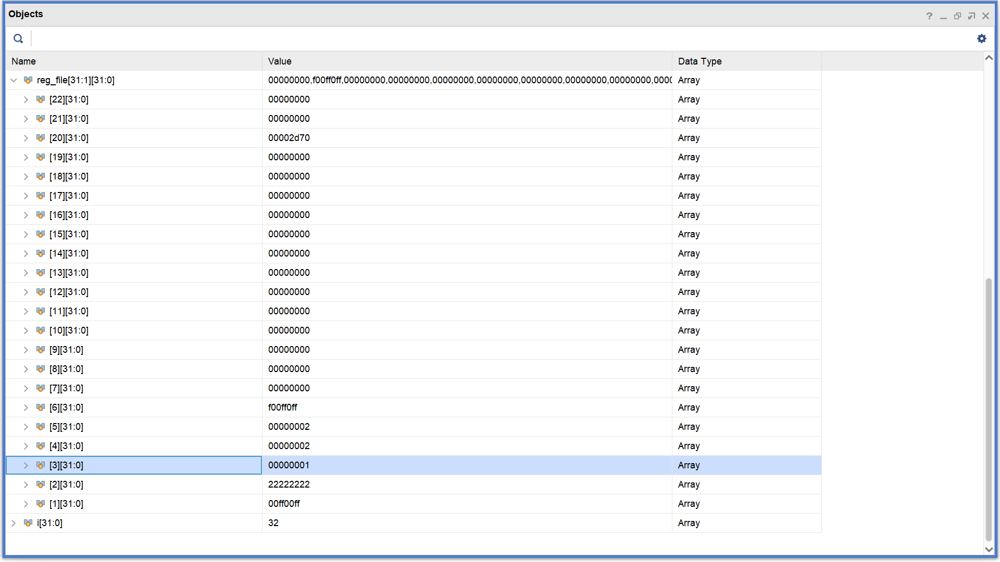
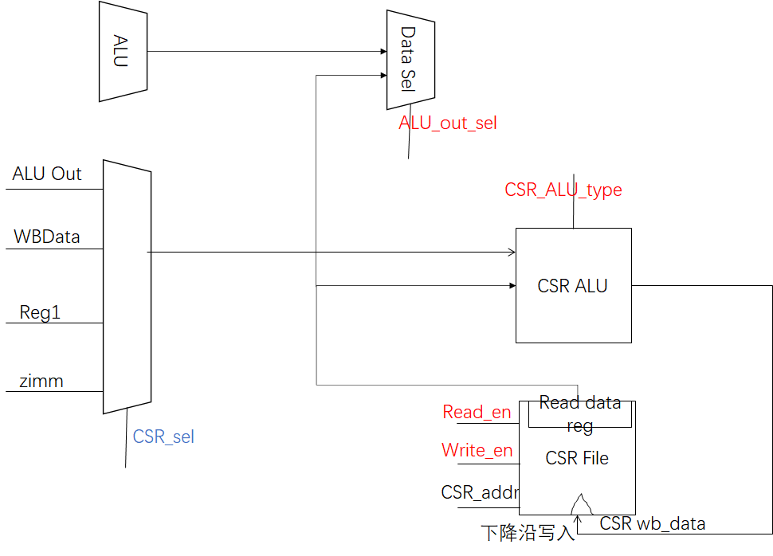
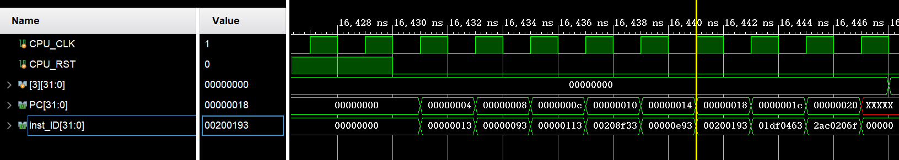
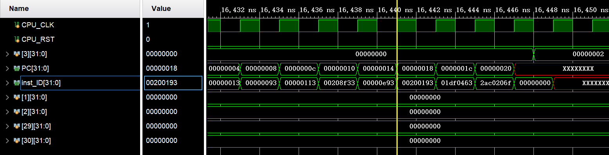

# lab2实验报告

PB17111640 刘硕

[TOC]

## 实验目标

​	本次实验的要求实现5段流水的RiscV处理器，数据通路支持除ebreak和ecall指令外的所有RV32I用户指令，我理解的本次实验的目标是为了让我们更加深刻地理解RiscV处理器处理转发的设计，同时通过自己设计CSR指令的数据通路加深对数据通路设计的理解。

## 实现环境和工具

环境：

​	操作系统：windows 10 pro

​	内存：16GB

​	处理器：i5-8250u

​	显卡：无

工具：

​	Vivado v2019.1 (64-bit)  

​	Typora(写报告)

## 实验内容和过程

​	这次实验本来分配了三周来完成，一周完成一个阶段。但是由于我在第三周才开始动手，加上验收的时候如果阶段二通过了就可以不检查阶段一，因此我跳过了阶段一，就直接去实现阶段二和阶段三了。

### 阶段二

​	在阶段二，我是一口气把所有代码都实现了再开始debug的。

​	把阶段二分为六个部分实现：IF、ID、EX、MEM、WB、Hazard

#### **IF阶段**：

​	这一部分包括俩个部件，最关键的是实现NPC Generator部件。**这里需要注意Jalr、Jal和Br信号的优先级**。具体内容我会在**实验总结**部分详细叙述。

#### **ID阶段**：

这部分的逻辑比较复杂，主要是要实现Controller Decoder和Immediate Extend部件。controller decoder要实现数据通路图中所有红色的信号。包括：jal、jalr、op2_src、load_npc、wb_select、alu_src1、alu_src2、ALU_func、br_type、load_type、cache_write_en、imm_type、reg_write、src_reg_en。jal信号和jalr只有在指令是jal指令和jalr指令时为真；只有当指令为R类指令时op2_src为0，表示选择Reg2；load_npc只有在jal和jalr指令时为1，表示把PC+4写回寄存器文件里；wb_select指令只有在指令为load指令时才为1，表示需要把Data Extesion里的内容写回寄存器堆；alu_src1只有在指令为auipc时才为0，表示需要把PCE-4作为alu_src1参与计算。剩下的信号比较复杂，写在了switch里面，代码附在下面：

```verilog
 assign alu_src2=(inst[6:0]==7'b0110011)?2'b00:
                                            (({inst[13:12],inst[6:0]}==9'b010010011)?2'b01:2'b10);

always@(*)
    begin
        case (inst[6:0])
            7'b1110011:begin //SYSTEM(CSR)
                ALU_func=`ADD;
                br_type=`NOBRANCH;
                load_type=`NOREGWRITE;
                cache_write_en=4'b0000;
                imm_type=`RTYPE;
                reg_write_en=1'b1;
                if (inst[14])
                    src_reg_en=2'b10;
                else
                    src_reg_en=2'b00;
            end
            7'b0110111: begin//LUI
                ALU_func=`LUI;
                br_type=`NOBRANCH;
                load_type=`LW;
                src_reg_en=2'b00;
                reg_write_en=1'b1;
                cache_write_en=4'b0000;
                imm_type=`UTYPE;
            end
            7'b0010111: begin//AUIPC
                ALU_func=`ADD;
                br_type=`NOBRANCH;
                load_type=`LW;
                src_reg_en=2'b00;
                reg_write_en=1'b1;
                cache_write_en=4'b0000;
                imm_type=`UTYPE;
            end
            7'b0010011: begin//立即数ALU指令
                br_type=`NOBRANCH;
                load_type=`LW;
                src_reg_en=2'b10;
                reg_write_en=1'b1;
                cache_write_en=4'b0000;
                imm_type=`ITYPE;
                case (inst[14:12])
                    3'b000:begin
                        ALU_func=`ADD;
                    end
                    3'b010:begin
                        ALU_func=`SLT;
                    end
                    3'b011:begin
                        ALU_func=`SLTU;
                    end
                    3'b100:begin
                        ALU_func=`XOR;
                    end
                    3'b110:begin
                        ALU_func=`OR;
                    end
                    3'b111:begin
                        ALU_func=`AND;
                    end
                    3'b001:begin
                        ALU_func=`SLL;
                    end
                    3'b101:begin
                        if(inst[30]==1)
                            ALU_func=`SRA;
                        else
                            ALU_func=`SRL;
                    end
                    default:ALU_func=`ADD;
                endcase
            end
            7'b0110011: begin//寄存器ALU指令
                br_type=`NOBRANCH;
                load_type=`LW;
                src_reg_en=2'b11;
                reg_write_en=1'b1;
                cache_write_en=4'b0000;
                imm_type=`RTYPE;
                case (inst[14:12])
                    3'b000:begin
                        if(inst[30]==1)
                            ALU_func=`SUB;
                        else
                            ALU_func=`ADD;
                    end
                    3'b010:begin
                        ALU_func=`SLT;
                    end
                    3'b011:begin
                        ALU_func=`SLTU;
                    end
                    3'b100:begin
                        ALU_func=`XOR;
                    end
                    3'b110:begin
                        ALU_func=`OR;
                    end
                    3'b111:begin
                        ALU_func=`AND;
                    end
                    3'b001:begin
                        ALU_func=`SLL;
                    end
                    3'b101:begin
                        if(inst[30]==1)
                            ALU_func=`SRA;
                        else
                            ALU_func=`SRL;
                    end
                    default:ALU_func=`ADD;
                endcase        
            end
            7'b1101111: begin//JAL 在BR adder计算有效地址
            // alu_src1 = 0; alu_src2 = 10(立即数)
                ALU_func=`ADD;
                br_type=`NOBRANCH;
                load_type=`LW;
                src_reg_en=2'b00;
                reg_write_en=1'b1;
                cache_write_en=4'b0000;
                imm_type=`JTYPE;
            end 
            7'b1100111: begin//JALR 在ALU计算有效地址
                // alu_src1 = 0(reg1); alu_src2 = 10(立即数)
                ALU_func=`ADD;
                br_type=`NOBRANCH;
                load_type=`LW;
                src_reg_en=2'b10;
                reg_write_en=1'b1;
                cache_write_en=4'b0000;
                imm_type=`ITYPE;
            end
            7'b1100011: begin//有条件跳转指令
                ALU_func=`ADD;
                load_type=`NOREGWRITE;
                src_reg_en=2'b11;
                reg_write_en=1'b0;
                cache_write_en=4'b0000;
                imm_type=`BTYPE;   
                case (inst[14:12])
                    3'b000:begin
                        br_type=`BEQ;
                    end
                    3'b001:begin
                        br_type=`BNE;
                    end
                    3'b100:begin
                        br_type=`BLT;
                    end
                    3'b101:begin
                        br_type=`BGE;
                    end
                    3'b110:begin
                        br_type=`BLTU;
                    end
                    3'b111:begin
                        br_type=`BGEU;
                    end
                    default:br_type=`NOBRANCH;
                endcase     
            end
            7'b0000011: begin//Load指令
                ALU_func=`ADD;
                br_type=`NOBRANCH;
                src_reg_en=2'b10;
                reg_write_en=1'b1;
                cache_write_en=4'b0000;
                imm_type=`ITYPE;
                case (inst[14:12])
                    3'b000:begin
                        load_type=`LB;
                    end
                    3'b001:begin
                        load_type=`LH;
                    end
                    3'b010:begin
                        load_type=`LW;
                    end
                    3'b100:begin
                        load_type=`LBU;
                    end
                    3'b101:begin
                        load_type=`LHU;
                    end
                    default:load_type=`NOREGWRITE;
                endcase
            end
            7'b0100011: begin//Store指令
                ALU_func=`ADD;
                br_type=`NOBRANCH;
                load_type=`NOREGWRITE;
                src_reg_en=2'b11;
                reg_write_en=1'b0;
                imm_type=`STYPE;  
                case (inst[14:12])
                    3'b000:begin
                        cache_write_en=4'b0001;
                    end
                    3'b001:begin
                        cache_write_en=4'b0011;
                    end
                    3'b010:begin
                        cache_write_en=4'b1111;
                    end
                    default:cache_write_en=4'b0000; 
                endcase      
            end
            default: begin
                ALU_func=`ADD;
                br_type=`NOBRANCH;
                load_type=`NOREGWRITE;
                src_reg_en=2'b00;
                reg_write_en=1'b0;
                cache_write_en=4'b0000;
                imm_type=`RTYPE;
            end
        endcase
    end
```

​	立即数扩展部件将立即数按照I、S、B、U、J五类指令进行立即数扩展，注意R类指令不需要扩展，我返回了32‘b0.

#### **EX阶段**：

​	这一部分主要实现ALU部件，以及BR Desion部件。逻辑比较简单。同时，所有的转发信号的选择都是在这里完成的。

#### **MEM阶段：**

​	主要是需要按照Data Cache的读数据的格式实现Data Extension部件。比较简单。

#### **WB阶段：**

​	无须实现任何部件。

#### **Hazard模块：**

​	这一部分逻辑比较复杂，我也写出来好多bug。

​	我首先用一个switch判断了所有的bubble和flush信号，比较简单。

​	再实现op1_sel信号，如果EX阶段需要用reg1,并且reg1和mem阶段dst寄存器相同且不为零号寄存器，同时mem指令不是load指令，mem指令需要写回寄存器，就从AluOut选取源操作数1；类似的情况源操作数1选择MBData；最后，根据ALU_src1信号选择是PCE-4还是Reg1；

​	op2_sel的使能情侣几乎和op1_sel完全一样，只是在确定使用转发通路的数据前要判断ex段的当前指令是不是R型指令，否则就会出bug，我会在**实验总结**部分详细叙述。

​	reg2_sel的设置也是差不多。

#### **测试阶段：**

设计的测试**阶段一**的指令如下：

```assembly
# 概述：测试阶段一指令的执行
# Author: WangXuan
# 
# 系统要求：1、具有一个大小至少为0x400 Byte的数据RAM （该程序中，其高地址用作栈）
#           2、请根据实际情况将a0设置为你的DataRam的地址，例如该系统中DataRam起始地址为0x00000000，则我第一个指令是lui a0, 0x00000
#
.org 0x0
 	.global _start
_start:
    lui x1,0xf000f   # x1  0xf000f000 
    slli x2,x1,4   # x2  0x000f0000 
    srli x3,x1,4   # x3  0x0f000f00 
    srai x4,x1,8   # x4  0xfff000f0 
    andi x5,x4,0x0f0  # x5  0x000000f0 
    ori x6,x5,0x0fe  # x6  0x000000fe 
    xori x7,x4,0x0f0  # x7  0xfff00000 
    and x8,x4,x5   # x8  0x000000f0 
    or x9,x8,x7   # x9  0xfff000f0 
    xor x10,x8,x9  # x10  0xfff00000 
    addi x11,x0,4  # x11 0x00000004 
    srl x12,x10,x11  # x12 0x0fff0000 
    sra x13,x10,x11  # x13  0xffff0000 
    sll x14,x10,x11  # x14 0xff000000 
    add x15,x13,x14  # x15 0xfeff0000 
    sub x16,x13,x14  # x16  0x00ff0000 
    slt x17,x15,x16  # x17  0x00000001 
    sltu x18,x15,x16 # x18 0x00000000 
    slti x19,x17,-1  # x19 0x00000000 
    sltiu x20,x17,-1 # x20 0x00000001 
    auipc x21,0x00001 # x21 0x00001190 
```

测试结果：



test1：



test2：


test3：



### 阶段三

#### CSR指令数据通路设计



​	其中红色信号表示Controller Decoder部件及其有关的信号段寄存器发出的信号。蓝色信号表示Hazard模块发出的信号，以实现数据相关的转发。

​	其中，CSR ALU是用来计算可能要写回到CSR File的数据的部件。每个需要CSR File执行读写的时钟周期，在上升沿的时候CSR_addr、Read_en、Write_en信号会通过信号段寄存器传给CSR File部件，于是在上升沿之后，下降沿之前CSR File需要把其需要读的数据读出来，保存在Read Data Reg中。同时，在下降沿之前，CSR ALU计算好需要写回CSR File的数据wb_data，在下降沿时把数据写回CSR File。

​	从CSR File读出的数据保存在寄存器可以保证数据不受到CSR写回指令的污染，然后读出的数据通过Data Sel部件进入阶段二的数据通路，并最终通过WB阶段写回寄存器文件。

​	这里我实现了全部的CSR指令对于零号寄存器的特别的要求，保证不会进行对CSR寄存器多余的读写。

#### 测试指令

```assembly
li t0,0x0011
li t1,0x0012
li t2,0x0013
li t3,0x0014
li t4,0x0015
li t5,0x0016
li t6,0x0001
csrrw t1,0x0a,t0
csrrs t3,0x0b,t2
csrrwi t4,0x0c,0x1a
csrrsi t5,0x0d,0x1b
csrrc t0,0x0a,t6
csrrci t1,0x0b,0x02
```

## 实验总结

### 踩坑经历

经历了大大小小的坑，印象最深刻的是下面这俩个

#### Jalr,jal,br信号的优先级

bug截图如下：





发生不正确的跳转。问题是jal、br和jalr的优先级问题没有考虑到，正确的优先级应该是EX段的跳转(jal,jalr)优先级高，屏蔽ID段的跳转(br)。

正确的代码：

```verilog
case ({jal,jalr,br})
    3'b100:NPC=jal_target;
    3'b110:NPC=jalr_target;
    3'b010:NPC=jalr_target;
    3'b001:NPC=br_target;
    3'b101:NPC=br_target;
    3'b000:NPC=PC;
    default: NPC=32'hxxxxxxxx;
endcase
```

#### Op2 Sel信号的特殊情况

​	在判定Op2 Sel信号是不是选择转发过来的数据时，需要首先检查当前指令是不是R类指令，如果不是R类就一定不要转发。因为非R类指令ALU的源操作数2的来源都是指令内部的字段经过扩展得到的，必然不是转发过来的。

### 总结收获

​	为了完成这个实验花了接近3天的时间，在github上阅读了所有类似的实现，一天写好了代码，又花了俩天debug。最大的感触是vivado进行debug实在是太麻烦了，而且我还不需要实现综合以及烧板子。

## 实验改进的意见

没什么意见，助教非常给力。