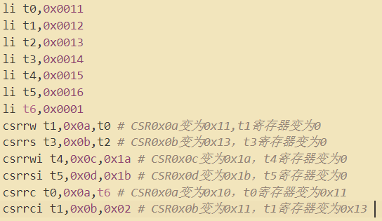

开始的错误：


ra = reg1  

sp = reg2

gp = reg3 

t4 = reg29 

t5 = reg30

样例一debug：

最主要的问题是jal、br和jalr的优先级问题（EX段的跳转优先级高，覆盖ID段的跳转）


样例二debug：

reg3=371停止

发现sb和lb之后值不同，说明Data cache有问题

猜测写回指令出了问题

事实是 对于S指令 同时需要Reg2的值和ALU计算Reg1+imm的情况没有列清楚

在判断Op2_sel需不需要转发的时候，要清楚只有当alu_src2是reg2的时候才需要转发

阶段一二：

```assembly
# 概述：测试阶段一指令的执行
# Author: WangXuan
# 
# 系统要求：1、具有一个大小至少为0x400 Byte的数据RAM （该程序中，其高地址用作栈）
#           2、请根据实际情况将a0设置为你的DataRam的地址，例如该系统中DataRam起始地址为0x00000000，则我第一个指令是lui a0, 0x00000
#
.org 0x0
 	.global _start
_start:
    lui x1,0xf000f   # x1  0xf000f000 
    slli x2,x1,4   # x2  0x000f0000 
    srli x3,x1,4   # x3  0x0f000f00 
    srai x4,x1,8   # x4  0xfff000f0 
    andi x5,x4,0x0f0  # x5  0x000000f0 
    ori x6,x5,0x0fe  # x6  0x000000fe 
    xori x7,x4,0x0f0  # x7  0xfff00000 
    and x8,x4,x5   # x8  0x000000f0 
    or x9,x8,x7   # x9  0xfff000f0 
    xor x10,x8,x9  # x10  0xfff00000 
    addi x11,x0,4  # x11 0x00000004 
    srl x12,x10,x11  # x12 0x0fff0000 
    sra x13,x10,x11  # x13  0xffff0000 
    sll x14,x10,x11  # x14 0xff000000 
    add x15,x13,x14  # x15 0xfeff0000 
    sub x16,x13,x14  # x16  0x00ff0000 
    slt x17,x15,x16  # x17  0x00000001 
    sltu x18,x15,x16 # x18 0x00000000 
    slti x19,x17,-1  # x19 0x00000000 
    sltiu x20,x17,-1 # x20 0x00000001 
    auipc x21,0x00001 # x21 0x00001190 
```


阶段2：

test3


test2


test1


CSR



li t0,0x0011

li t1,0x0012

li t2,0x0013

li t3,0x0014

li t4,0x0015

li t5,0x0016

li t6,0x0001

csrrw t1,0x0a,t0

csrrs t3,0x0b,t2

csrrwi t4,0x0c,0x1a

csrrsi t5,0x0d,0x1b

csrrc t0,0x0a,t6

csrrci t1,0x0b,0x02