直接映射 快排256个数(包括打印全部结果)

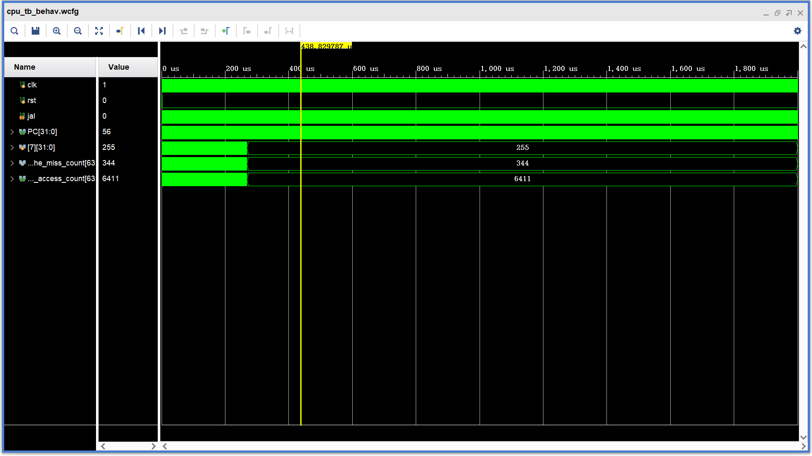

组相联系数为3 替换策略FIFO 快排256个数(包括打印全部结果)

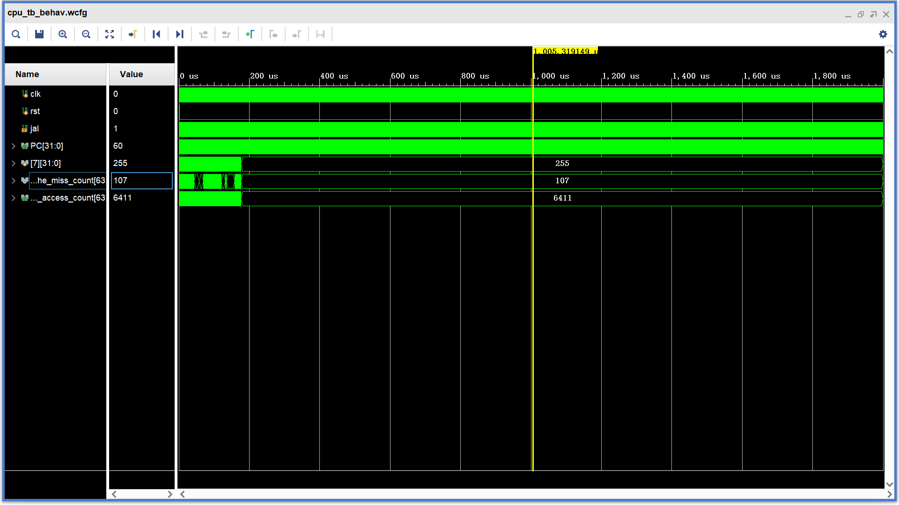

组相联系数为3 替换策略LRU 快排256个数(包括打印全部结果)

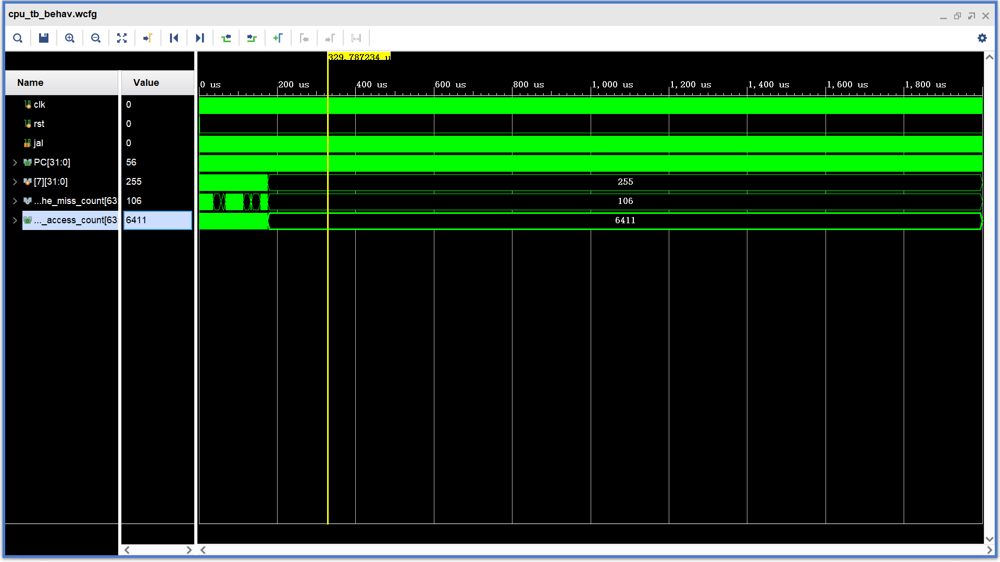

组相联系数为6 替换策略LRU 快排256个数(包括打印全部结果)

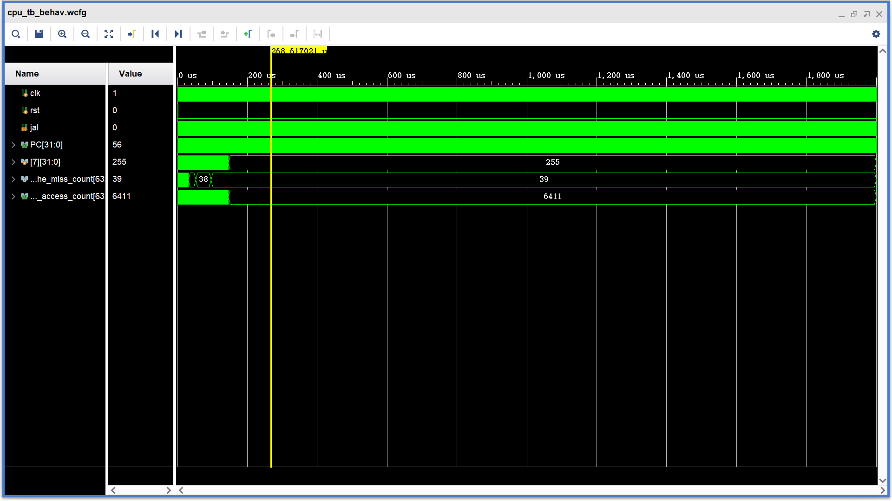

组相联系数为12 替换策略LRU 快排256个数(包括打印全部结果)（和组相联度为6的情况相同）

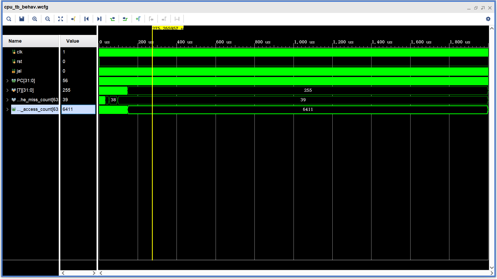

组相联系数为3 替换策略LRU 快排512个数(包括打印全部结果)

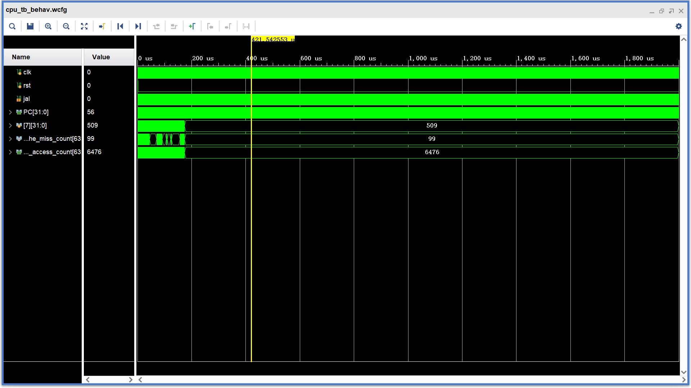

组相联系数为6 替换策略LRU 快排512个数(包括打印全部结果)

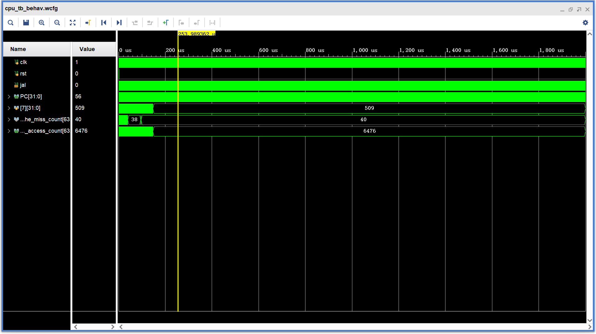

组相联系数为12 替换策略LRU 快排512个数(包括打印全部结果)（和组相联度为6的结果相同）

——————————————————————————————————————————————————

16*16矩阵 直接映射 

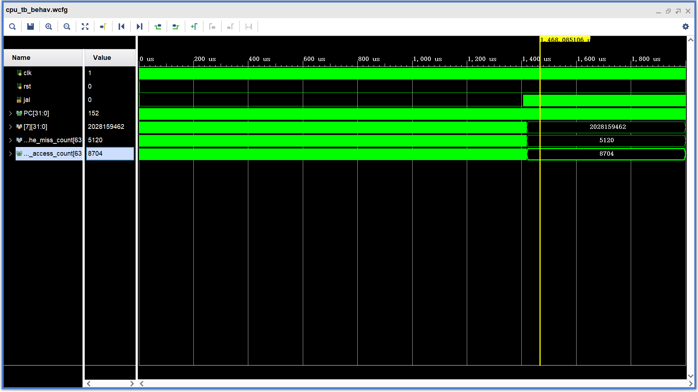

16*16矩阵 FIFO 组连通度为3

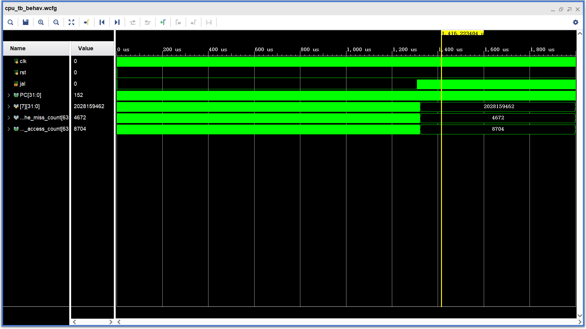

16*16矩阵 FIFO 组连通度为6

16*16矩阵 FIFO 组连通度为12

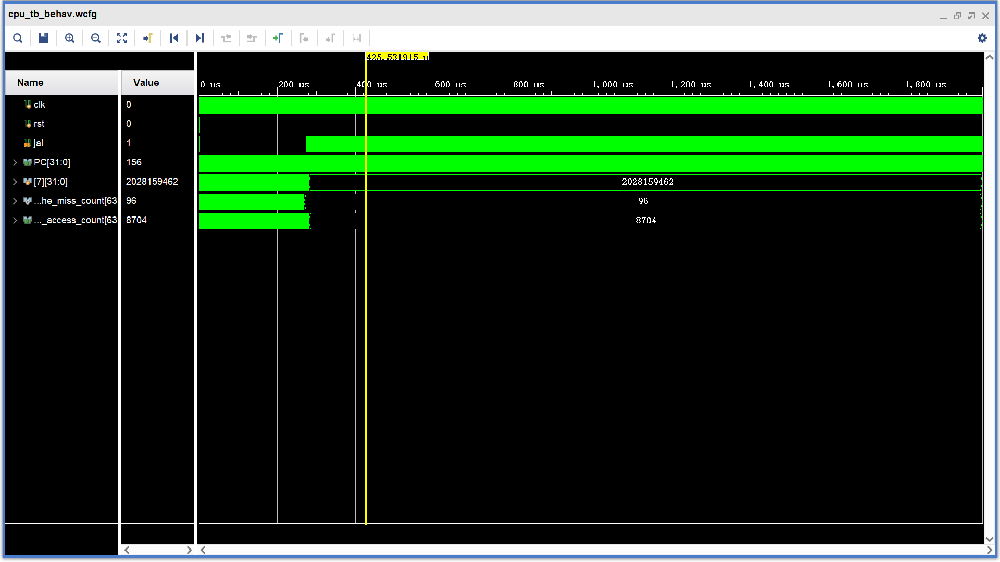

16*16矩阵 组连通度3 LRU

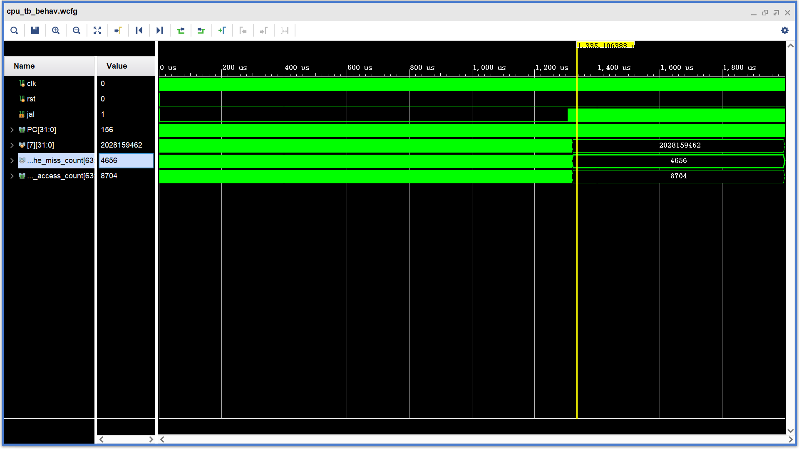

16*16矩阵  组连通度6 LRU

16*16矩阵 组连通度12 LRU

